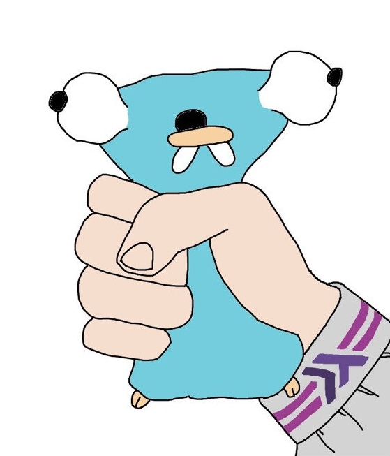

# Go Gopher Squeeze

Welcome to the **Go Gopher Squeeze** project! Here, we explore the interaction between Go and Haskell through a fun, illustrative approach.

## Project Overview

This project demonstrates how to call a Go function from Haskell via C. The concept is humorously depicted in our project mascot, the Go Gopher, being squeezed by a hand with a Haskell tattoo.

## Contents

- **Go Code**: A simple Go program that serves as the backend for our squeezing simulation.
- **Haskell Code**: Haskell code that interacts with the Go function through a C interface.
- **Makefile**: For building and running the project.
- **flake.nix**: Nix configuration for development environment setup.

## Getting Started

To get started with this project, follow the `Makefile`. `make` should provide a list of helpful targets.

You can provision the development environment trivially with `nix develop`.